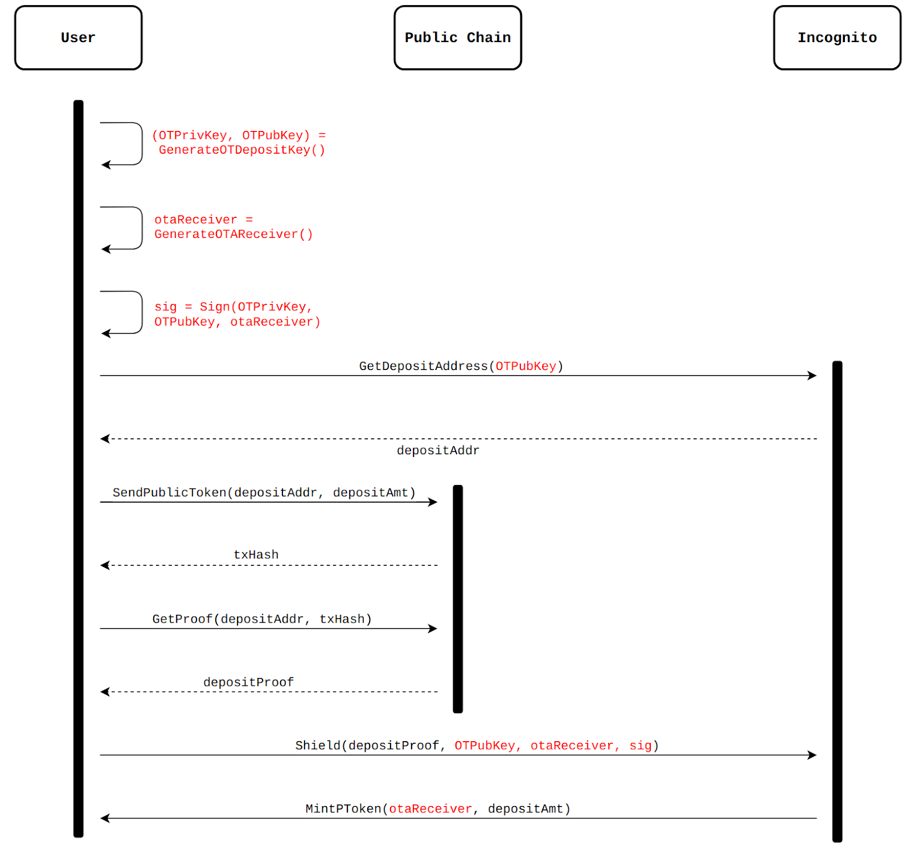

# Before Going Further

Please read through the tutorials on [key submission](../../accounts/submit_key.md)
and [UTXO cache](../../accounts/utxo_cache.md) for proper balance and UTXO retrieval. Skip these parts if you're familiar
with these notions.

# Depositing Portal tokens to Incognito


## Using Payment Addresses

**Figure.** _Portal shielding with Incognito payment addresses_

In this approach, a **User** must perform the following steps:
1. Generate the depositing address (_depositAddr_, a multi-sig address) using his payment address (_incAddr_). 
Each _incAddr_ will have a uniquely corresponding _depositAddr_. Details of this can be found in this [post](https://we.incognito.org/t/shipped-incognito-s-trustless-non-custodial-bitcoin-bridge/9605).
2. Send an amount of the public token to the generated depositing address.
3. Query the **Public Chain** to get the _depositProof_.
4. Send the _depositProof_ to **Incognito**.
**Incognito** mints the corresponding amount for **User** using his _incAddr_.

For this tutorial, we only focus on Steps 1 and 4.
### Generate deposit addresses (Step 1)
To generate a shielding address from the _incAddr_, we can use the function `GeneratePortalShieldingAddress` with the following
parameters:
* `chainCodeStr`: use _incAddr_ as the chainCodeStr. This chainCodeStr is then combined with public keys
of the Beacon Committee to produce a unique multi-sig address (_depositAddr_).
* `tokenIDStr`: the tokenID of the shielding asset. At the moment, the Portal only supports BTC.

```go
depositAddr, err := ic.GeneratePortalShieldingAddress(addr, tokenIDStr)
if err != nil {
    log.Fatal(err)
}
fmt.Printf("depositAddr: %v\n", depositAddr)
```

`GeneratePortalShieldingAddress` is deterministic. That is, with the same `chainCodeStr` and `tokenIDStr`, it will return 
the same `depositAddr`. Therefore, for two separate shielding requests with the same _incAddr_, the same depositAddr is generated. Therefore, one can tell that these requests belong to the same **User**.

### Create shielding transactions (Step 4)
After sending the public token to _depositAddr_, the **User** waits for enough confirmations (6 for BTC) and then retrieves
the _depositProof_. Retrieval of depositProof is out of the scope of the SDK. More detail about this can be accessed [here](https://github.com/incognitochain/incognito-cli/blob/main/portal.go#L77).

Having the _depositProof_, the **User** can submit it to the **Incognito** using the function `CreateAndSendPortalShieldTransaction`:
```go
depositProof := "DEPOSIT_PROOF"

txHashStr, err := ic.CreateAndSendPortalShieldTransaction(
    privateKey,
    tokenIDStr,
    addr,
    depositProof,
    nil, nil,
)
fmt.Printf("TxHash: %v\n", txHashStr)
```

### Example
[shield.go](../../../code/bridge/portal/shield_addr/shield.go)

```go
package main

import (
	"fmt"
	"github.com/incognitochain/go-incognito-sdk-v2/incclient"
	"log"
	"time"
)

func main() {
	ic, err := incclient.NewTestNetClient()
	if err != nil {
		log.Fatal(err)
	}

	privateKey := "YOUR_PRIVATE_KEY"
	addr := "PAYMENT_ADDRESS"
	tokenIDStr := "PORTAL_TOKEN"

	depositAddr, err := ic.GeneratePortalShieldingAddress(addr, tokenIDStr)
	if err != nil {
		log.Fatal(err)
	}
	fmt.Printf("depositAddr: %v\n", depositAddr)

	// SEND SOME PUBLIC TOKENS TO depositAddr, AND THEN RETRIEVE THE SHIELDING PROOF.
	// SEE HOW TO GET THE SHIELD PROOF: https://github.com/incognitochain/incognito-cli/blob/main/portal.go#L77
	depositProof := "DEPOSIT_PROOF"

	txHashStr, err := ic.CreateAndSendPortalShieldTransaction(
		privateKey,
		tokenIDStr,
		addr,
		depositProof,
		nil, nil,
	)
	fmt.Printf("TxHash: %v\n", txHashStr)

	time.Sleep(10 * time.Second)

	fmt.Printf("check shielding status\n")
	for {
		status, err := ic.GetPortalShieldingRequestStatus(txHashStr)
		if err != nil {
			time.Sleep(5 * time.Second)
			continue
		}
		fmt.Printf("shielding status: %v\n", status)
		break
	}
}

```

## Using One-time Depositing Addresses
Shielding via One-time depositing addresses is slightly different from using _incAddr_ and provides better privacy. 
The general flow is as follows:

**Figure.** _Portal shielding with One-time depositing addresses (differences are indicated in red)._

So, the idea is simple: let the **User** generate a one-time depositing address each time he deposits money into the **Incognito** network. 

1. Generate a one-time key pair (_OTPrivKey_, _OTPubKey_) to initiate the shielding request.
2. Generate a one-time Incognito address (_otaReceiver_) for receiving the corresponding token.
3. Sign this otaReceiver using the generated _OTPrivKey_ in Step 1. This step is needed to ensure the authenticity of the shield.
4. Generate a depositing address using the _OTPubKey_ instead of his payment address incAddr.
5. Send an amount of the public token to the generated depositing address.
6. Query the **Public Chain** to get the _depositProof_.
7. Send the _depositProof_ and corresponding data (_OTPubKey_, _otaReceiver_, _sig_) to **Incognito**.
8. Incognito mints the corresponding amount for **User** via the otaReceiver.

The main differences are how _depositAddr_ is generated, and what are required to construct a valid shielding request. Other Steps are the same as in the previous approach.

### Generate deposit addresses (Steps 1, 4)
Each time the **User** want to shield, he must generate an OTDepositKey. This DepositKey is used to generate the deposit address.
The OTDepositKey consists of the following fields:
```go
// OTDepositKey represents a pair of one-time depositing key for shielding.
type OTDepositKey struct {
	// PrivateKey is used to signed shielding requests when this OTDepositKey is employed.
	PrivateKey []byte

	// PublicKey serves as a chain-code to generate a unique multi-sig address (depositAddr) for shielding request. It is
	// derived from the PrivateKey, and is used to verify signatures signed by the PrivateKey to authorize shielding requests.
	// It is used to replace the Incognito address for better privacy. Different PublicKey results in a different depositAddr.
	// Note that one re-use the OTPubKey in many shielding requests.
	// However, this is NOT RECOMMENDED because it will lower the privacy level and allow an observer to link his shields.
	PublicKey []byte

	// Index is the index of the current OTDepositKey. Since most of the time, an OTDepositKey is generated from a master key,
	// this Index serves as a tool for the ease of key management. More detail about the Index can be found here: https://we.incognito.org/t/work-in-progress-one-time-shielding-addresses/15677
	Index uint64
}
```

For his privateKey, the User can generate a depositKey using the function `GenerateDepositKeyFromPrivateKey` supplied with 
a `depositKeyIndex`. The index is of the **User**'s choice. Apart from this, the **User** can also use the function `GetNextOTDepositKey` if he is not sure
about what index to use.

```go
// Generate depositKey from the privateKey and a depositKeyIndex
depositKey, err := ic.GenerateDepositKeyFromPrivateKey(privateKey, tokenIDStr, depositKeyIndex)
if err != nil {
    log.Fatal(err)
}
jsb, _ := json.Marshal(depositKey)
fmt.Printf("depositKey: %v\n", string(jsb))
```

Then, the PublicKey of the generated DepositKey is used as the `chainCodeStr` to generate the actual _depositAddr_.
```go
// Generate depositAddr from the PublicKey of the depositKey
depositPubKeyStr := base58.Base58Check{}.NewEncode(depositKey.PublicKey, 0)
depositAddr, err := ic.GeneratePortalShieldingAddress(depositPubKeyStr, tokenIDStr)
if err != nil {
    log.Fatal(err)
}
fmt.Printf("depositAddr: %v\n", depositAddr)
```

From this, we can observe the following. If different shielding requests (of the same **User**) associate with different 
`OTDepositKey`, then so do _depositAddr_'s. This therefore hugely improves the shielding privacy.

### Create shielding transactions (Steps 2, 3, 7)
Creating a shielding transaction now can be done via the function `CreateAndSendPortalShieldTransactionWithDepositKey` supplied
with a `PortalDepositParams`. A `PortalDepositParams` consists of the following fields.
```go
// PortalDepositParams consists of parameters for creating a Portal shielding transaction.
// A PortalDepositParams is valid if at least one of the following conditions hold:
//	- Signature is not empty
//		- Receiver and DepositPubKey must not be empty
//	- Signature is empty
//		- If Receiver is empty, it will be generated from the sender's privateKey
//		- If DepositPrivateKey is empty, it will be derived from the DepositKeyIndex
//		- DepositPubKey is derived from DepositPrivateKey.s
type PortalDepositParams struct {
    // TokenID is the shielding asset ID.
    TokenID string
    
    // ShieldProof is a merkel proof for the shielding request.
    ShieldProof string
    
    // DepositPrivateKey is a base58-encoded deposit privateKey used to sign the request.
    // If set empty, it will be derived from the DepositKeyIndex.
    DepositPrivateKey string
    
    // DepositPubKey is a base58-encoded deposit publicKey. If Signature is not provided, DepositPubKey will be derived from the DepositPrivateKey.
    DepositPubKey string
    
    // DepositKeyIndex is the index of the OTDepositKey.
    DepositKeyIndex uint64
    
    // Receiver is a base58-encoded OTAReceiver. If set empty, it will be generated from the sender's privateKey.
    Receiver string
    
    // Signature is a valid signature signed by the owner of the shielding asset.
    // If Signature is not empty, DepositPubKey and Receiver must not be empty.
    Signature string
}
```
A `Portal DepositParams` is valid if at least one of the following conditions hold:
- Signature is not empty
  - Receiver and DepositPubKey must not be empty
- Signature is empty
  - If Receiver is empty, it will be generated from the sender's privateKey
  - If DepositPrivateKey is empty, it will be derived from the DepositKeyIndex
  - DepositPubKey is derived from DepositPrivateKey.

In this example, we consider the first case where shielding requests use OTAReceivers to receive the minted token.
An OTAReceiver is a one-time Incognito address. Unlike the previous design where _incAddr_ is used (and thus privacy is sacrificed)
and the **Incognito** network knows how to mint the corresponding token for this address,
this _otaReceiver_ is needed to improve the privacy level. The otaReceiver can be generated from the payment address as follows:
```go
tokenID, _ := common.Hash{}.NewHashFromStr(tokenIDStr)
w, err := wallet.Base58CheckDeserialize(addr)
if err != nil {
    log.Fatal(err)
}
otaReceivers, err := incclient.GenerateOTAReceivers([]common.Hash{*tokenID}, w.KeySet.PaymentAddress)
if err != nil {
    log.Fatal(err)
}
otaReceiver := otaReceivers[*tokenID]
```

However, _otaReceiver_ alone is insufficient to guarantee the authenticity of the receiver.
Therefore, some kind of authorization must be employed. Here, we use the PrivateKey of the OTDepositKey to sign this
_otaReceiver_, and the **Incognito** network uses the corresponding PublicKey to verify the signature.
```go
signature, err := incclient.SignDepositData(depositKey, otaReceiver.Bytes())
if err != nil {
    log.Fatal(err)
}
```

The final `DepositParams` is:
```go
depositParam := incclient.DepositParams{
    TokenID:       tokenIDStr,
    ShieldProof:   depositProof,
    DepositPubKey: depositPubKeyStr,
    Receiver:      otaReceiver.String(),
    Signature:     base58.Base58Check{}.Encode(signature, 0),
}

// Create the shielding transaction
txHashStr, err := ic.CreateAndSendPortalShieldTransactionWithDepositKey(
  privateKey,
  depositParam,
  nil, nil,
)
fmt.Printf("TxHash: %v\n", txHashStr)
```

### Example
[shield.go](../../../code/bridge/portal/shield_one_time/shield.go)

```go
package main

import (
	"encoding/json"
	"fmt"
	"github.com/incognitochain/go-incognito-sdk-v2/common"
	"github.com/incognitochain/go-incognito-sdk-v2/common/base58"
	"github.com/incognitochain/go-incognito-sdk-v2/incclient"
	"github.com/incognitochain/go-incognito-sdk-v2/wallet"
	"log"
	"time"
)

func main() {
	ic, err := incclient.NewTestNetClient()
	if err != nil {
		log.Fatal(err)
	}

	privateKey := "YOUR_PRIVATE_KEY"
	addr := "PAYMENT_ADDRESS"
	tokenIDStr := "PORTAL_TOKEN"
	depositKeyIndex := uint64(0)

	// Generate depositKey from the privateKey and a depositKeyIndex
	depositKey, err := ic.GenerateDepositKeyFromPrivateKey(privateKey, tokenIDStr, depositKeyIndex)
	if err != nil {
		log.Fatal(err)
	}
	jsb, _ := json.Marshal(depositKey)
	fmt.Printf("depositKey: %v\n", string(jsb))

	// Generate an OTAReceiver and sign it
	tokenID, _ := common.Hash{}.NewHashFromStr(tokenIDStr)
	w, err := wallet.Base58CheckDeserialize(addr)
	if err != nil {
		log.Fatal(err)
	}
	otaReceivers, err := incclient.GenerateOTAReceivers([]common.Hash{*tokenID}, w.KeySet.PaymentAddress)
	if err != nil {
		log.Fatal(err)
	}
	otaReceiver := otaReceivers[*tokenID]
	signature, err := incclient.SignDepositData(depositKey, otaReceiver.Bytes())
	if err != nil {
		log.Fatal(err)
	}

	// Generate depositAddr from the PublicKey of the depositKey
	depositPubKeyStr := base58.Base58Check{}.NewEncode(depositKey.PublicKey, 0)
	depositAddr, err := ic.GeneratePortalShieldingAddress(depositPubKeyStr, tokenIDStr)
	if err != nil {
		log.Fatal(err)
	}
	fmt.Printf("depositAddr: %v\n", depositAddr)

	// SEND SOME PUBLIC TOKENS TO depositAddr, AND THEN RETRIEVE THE SHIELDING PROOF.
	// SEE HOW TO GET THE SHIELD PROOF: https://github.com/incognitochain/incognito-cli/blob/main/portal.go#L77
	depositProof := "DEPOSIT_PROOF"

	depositParam := incclient.DepositParams{
		TokenID:       tokenIDStr,
		ShieldProof:   depositProof,
		DepositPubKey: depositPubKeyStr,
		Receiver:      otaReceiver.String(),
		Signature:     base58.Base58Check{}.Encode(signature, 0),
	}

	// Create the shielding transaction
	txHashStr, err := ic.CreateAndSendPortalShieldTransactionWithDepositKey(
		privateKey,
		depositParam,
		nil, nil,
	)
	fmt.Printf("TxHash: %v\n", txHashStr)

	time.Sleep(10 * time.Second)

	fmt.Printf("check shielding status\n")
	for {
		status, err := ic.GetPortalShieldingRequestStatus(txHashStr)
		if err != nil {
			time.Sleep(5 * time.Second)
			continue
		}
		fmt.Printf("shielding status: %v\n", status)
		break
	}
}
```

---
Return to [the table of contents](../../../../README.md).
